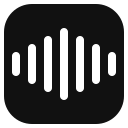

# Syrinx

Hold-to-talk dictation for macOS. Hold Right Option, speak, release — your words land wherever the cursor is. Fully on-device, no account, no cloud.


## Features

- **Push-to-talk anywhere** — works in every app with a text field, no plugins
- **On-device speech recognition** — 16.9 MB Whistle model, audio never leaves your Mac
- **Fast** — ~0.2 s from key release to typed text
- **Small live pill** — level bars pulse top-center while you talk, then it's gone
- **7 languages** — English, German, French, Spanish, Italian, Dutch, Polish (auto-detected)
- **Bonus CLI** — `syrinx-transcribe` turns any audio file into JSON text

## Install

```sh
curl -fsSL https://raw.githubusercontent.com/rodriveiga01/syrinx/main/install.sh | bash
```

Or clone and run `./install.sh`. It installs the engine (`cactus-needle` via pipx), downloads the model, and starts the dictation daemon at login.

Two manual steps (macOS requires your clicks):

1. The installer prints an `open -R …` command — run it and drag the revealed file into System Settings → Privacy & Security → Accessibility (toggle on).
2. Hold Right Option and speak once — allow the Microphone prompt.

## Usage

Click any text field, **hold Right Option, speak, release**. That's it.

- Pressing another key mid-hold cancels the take (Option shortcuts keep working).
- Taps under ~0.4 s and silence are ignored; takes cap at 30 s.
- `syrinx --key right-cmd` switches the hotkey (also `right-ctrl`).
- `syrinx-transcribe clip.wav [--words]` transcribes files to JSON.
- Logs: `tail -f ~/.cache/syrinx/syrinx.log`
- Stop: `launchctl bootout gui/$(id -u)/com.syrinx.dictate`
- Uninstall: `./uninstall.sh`

## How it works

`syrinx` is a background daemon: a global hotkey listener records 16 kHz mic audio while the key is held, the preloaded Whistle model transcribes it in-process, and the text is pasted via clipboard + a synthetic Cmd+V. The pill overlay is a borderless floating panel with live RMS bars. Everything runs locally — the only network use is the one-time model download.

## Known limitations

- Tested on Apple silicon; Intel Macs are untested.
- The Accessibility grant is tied to the Homebrew Python build — after `brew upgrade` replaces Python, re-grant it once.
- Clipboard is briefly borrowed for pasting (restored right after, unless you copy something new mid-paste).

## Credits

Speech model and engine: [Cactus Whistle / Needle](https://cactuscompute.com/blog/whistle) (`cactus-needle`,7 languages, 16.9 MB). UI inspiration: Wispr Flow's floating bar.

## License

MIT — see [LICENSE](LICENSE).
